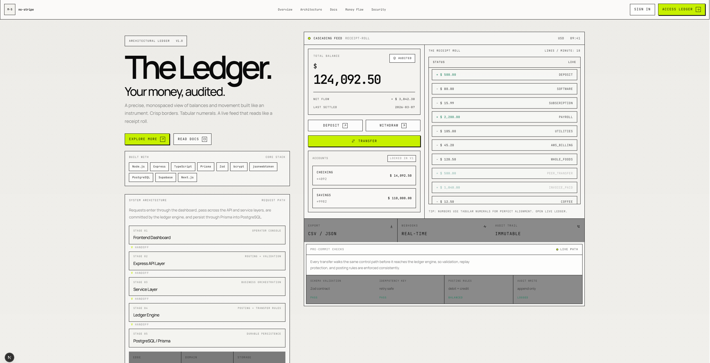
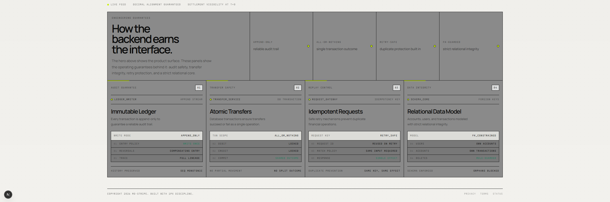
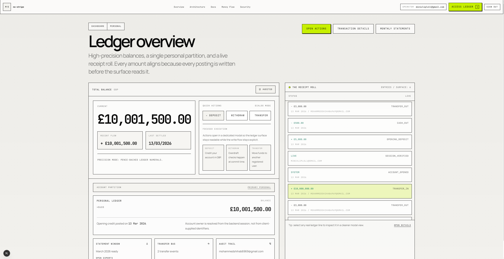
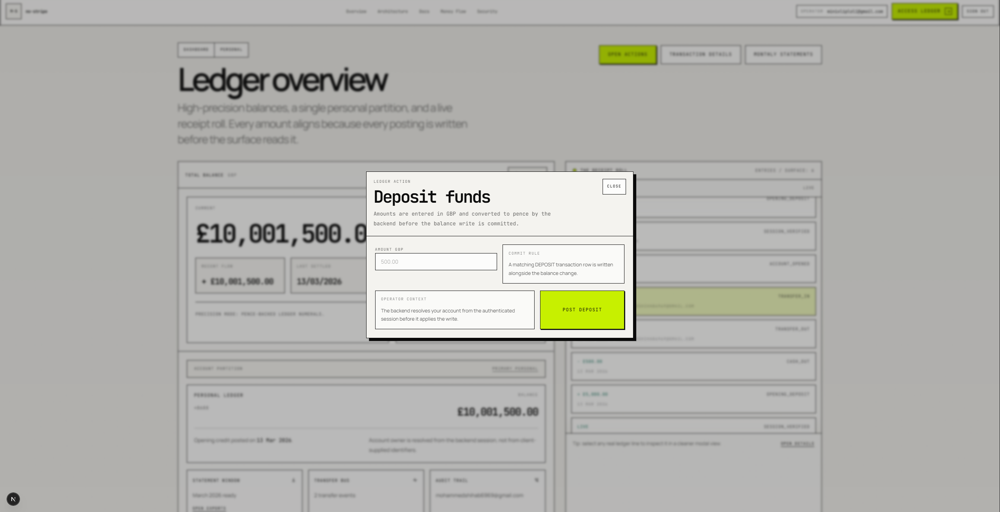
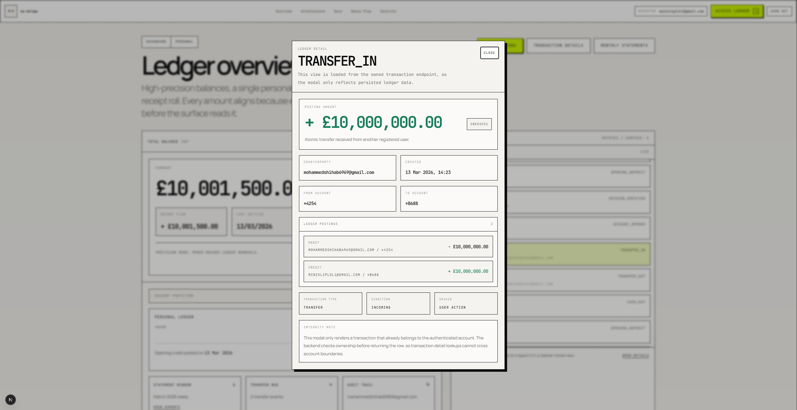
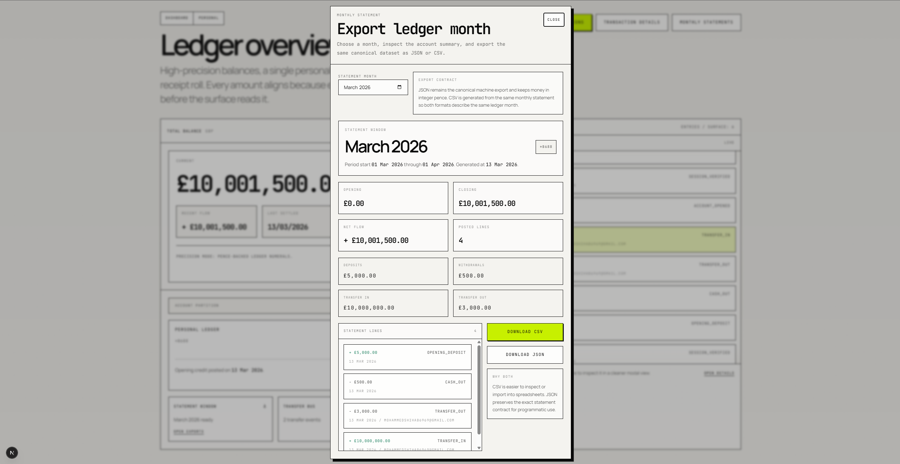
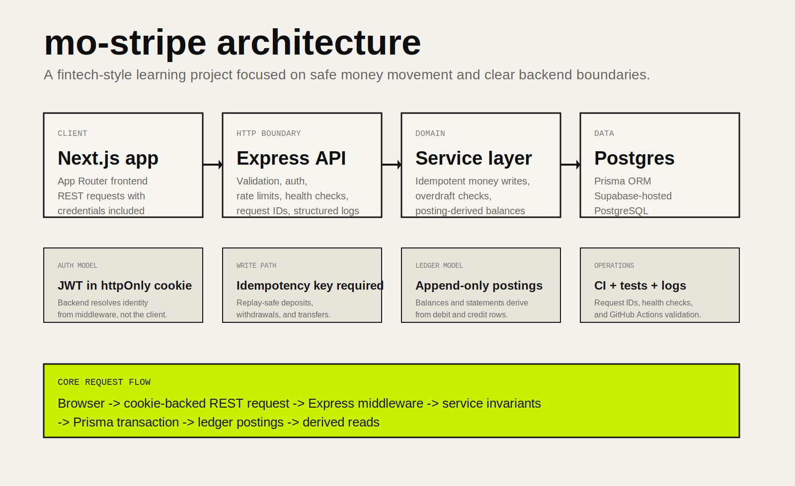

# mo-stripe

`mo-stripe` is a fintech-style ledger application built to demonstrate backend engineering decisions that matter in money movement systems.

The project focuses on:

- cookie-backed JWT authentication
- idempotent financial writes
- append-only ledger postings
- balances derived from postings instead of mutable snapshots
- monthly statement exports
- integration-tested invariants, CI, and request-level observability

## Product Preview

<p>
  
  
</p>
<p>
  
</p>
<p>
  
  
</p>
<p>
  
</p>

## Architecture



## Why This Project Is Strong

- Auth stays server-trusting: JWTs live in `httpOnly` cookies and protected routes derive identity from backend middleware.
- Money uses integer minor units and append-only debit / credit postings.
- Deposits, withdrawals, and transfers are atomic and idempotent.
- Balances and monthly statements are derived from ledger postings.
- Sensitive routes are rate-limited and oversized payloads are rejected early.
- Backend quality is backed by integration tests, GitHub Actions CI, request IDs, structured logs, and a health endpoint.

## Core Features

- One personal account per user, provisioned automatically on registration
- Demo opening balance recorded as a real transaction, not a silent mutation
- Deposit, withdraw, and transfer flows
- Transaction history and transaction detail views
- Monthly statement generation with CSV and JSON export
- Route-specific abuse protection on login, registration, statement generation, and money-moving endpoints

## Stack

- Frontend: Next.js App Router, TypeScript, Tailwind CSS
- Backend: Node.js, Express, TypeScript, Prisma ORM
- Database: PostgreSQL on Supabase
- Auth: bcrypt, JWT, `httpOnly` cookie session
- Testing: Vitest, Supertest, GitHub Actions CI

## API Surface

Auth:

- `POST /register`
- `POST /login`
- `POST /logout`
- `GET /session`

Account reads:

- `GET /account`
- `GET /account/transactions`
- `GET /account/transactions/:transactionId`
- `GET /account/statements/monthly`

Money movement:

- `POST /account/deposit`
- `POST /account/withdraw`
- `POST /account/transfer`

Operational:

- `GET /health`

All financial write endpoints require an `Idempotency-Key` header.

## Local Setup

Backend:

```bash
cd backend
npm install
```

Create `backend/.env`:

```env
DIRECT_URL=your_postgres_connection_string
JWT_SECRET_KEY=replace_with_a_long_random_secret
PORT=4000
NODE_ENV=development
CORS_ORIGIN=http://localhost:3000
TRUST_PROXY=1
```

Apply migrations and start the API:

```bash
npx prisma migrate deploy
npm run seed
npm run dev
```

Frontend:

```bash
cd frontend
npm install
```

Create `frontend/.env.local`:

```env
AUTH_API_URL=http://localhost:4000
```

`NEXT_PUBLIC_AUTH_API_URL` is still supported as a fallback, but the frontend now prefers the server-only `AUTH_API_URL` because Vercel proxies session-aware requests through same-origin `/api` routes.

Start the frontend:

```bash
npm run dev
```

## Testing and CI

Backend integration tests use a disposable Postgres database and truncate tables between runs:

```bash
cd backend
ALLOW_TEST_DB_RESET=true npm run test:integration
```

GitHub Actions provisions Postgres, applies migrations, runs backend integration tests, then runs frontend lint and production build checks.

## Current Tradeoffs

- The system is intentionally scoped to one personal account per user.
- Logout clears the cookie but does not provide full token revocation.
- Rate limiting currently uses the in-process memory store; multi-instance deployment would need a shared store such as Redis.
- Reversals, refunds, and reconciliation workflows are not implemented yet.

## Next Steps

1. Add compensating entries for reversals and refunds.
2. Add stronger session revocation and refresh-token architecture.
3. Move abuse protection to a distributed store or edge layer for multi-instance deployment.
4. Deploy the frontend and backend publicly with metrics and alerting.

## Why I built this?

This project is meant to show more than framework familiarity. It shows that I can reason about:

- trust boundaries
- relational ownership
- safe money movement
- auditability
- operational hardening
- pragmatic system scope
